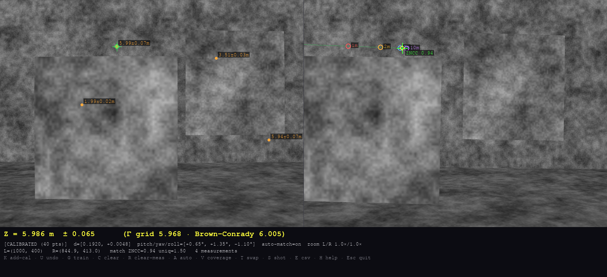
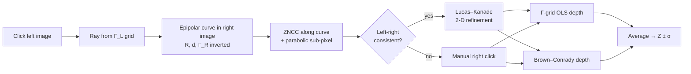
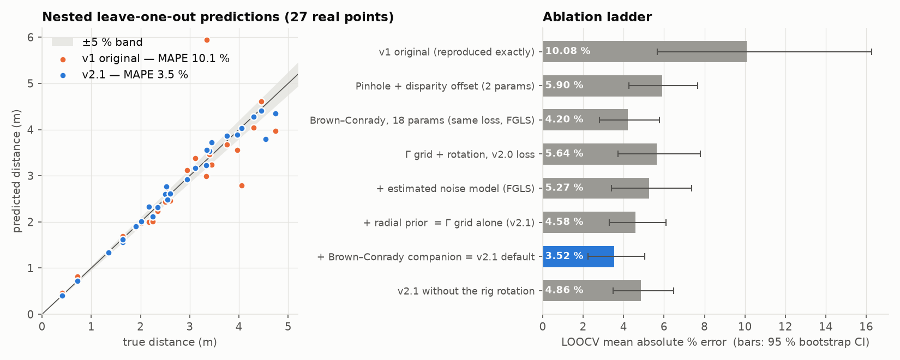
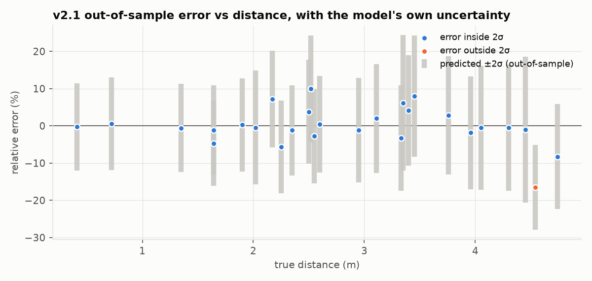
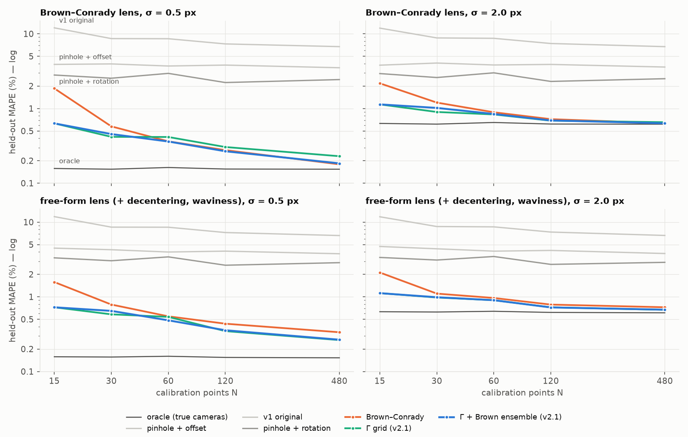
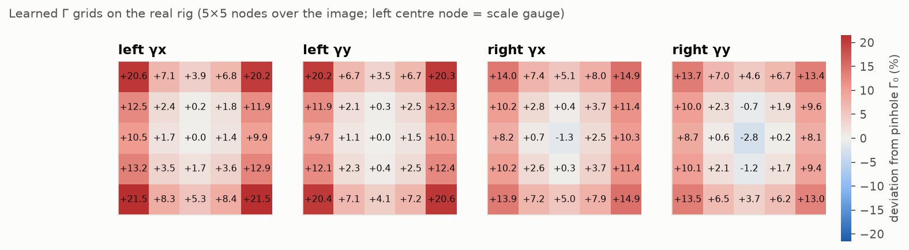
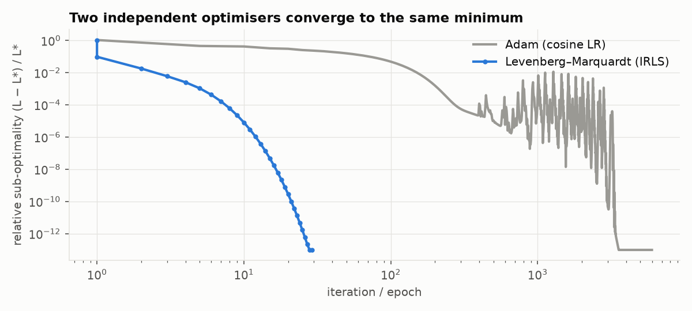

# Stereo Distance Calculator

[](https://github.com/GEV44/stereo-distance-calculator/actions/workflows/ci.yml)
[](pyproject.toml)
[](LICENSE)

**Metric distance from two cameras with a transparent, hand-derived model.** Each camera is
described by a 5×5 grid **Γ** of effective inverse focal lengths (the lens model); the rig by a
baseline and a relative rotation. The Γ grid is regularised towards a learned radial field, the
click- and label-noise levels are estimated from the data, and the robust objective is solved by
Levenberg–Marquardt with a hand-derived Jacobian — **pure NumPy, no autodiff, no SciPy, no deep
learning**. The derivation, a proof that the Γ grid generalises radial lens distortion, and the full
evaluation are in [`docs/MATHEMATICAL_FOUNDATION.pdf`](docs/MATHEMATICAL_FOUNDATION.pdf).


<sub>The measuring app on the built-in ray-traced demo scene (ground truth: box 2.0 m, panel 3.5 m).
Clicking the left image searches the curved epipolar line in the right image; accepted matches are
measured instantly as <i>Z ± σ</i>, with both ensemble members shown.</sub>

---

## Results at a glance

All real-data numbers are **nested** leave-one-out cross-validation: every data-dependent choice
(noise model, regularisation strength) is made from the training points only.

| | v1 (original) | **v2.1 (this version)** |
|---|---|---|
| Real data, MAPE (27 points) | 10.08 % | **3.52 %** (p = 0.0035 vs v1, Holm-corrected) |
| Real data, median error | 5.98 % | **1.96 %** |
| Real data, points within 5 % / 10 % | 37 % / 67 % | **74 % / 96 %** |
| Real data, worst point | 77 % | **16.5 %** |
| Distance to the noise floor | — | observed 3.52 % vs **3.13 % predicted from measurement noise alone** |
| Synthetic free-form lens, held-out MAPE (N = 120, σ = 0.5 px) | 7.25 % | **0.36 %** (oracle floor 0.15 %) |
| Uncertainty ±2σ coverage (out-of-sample) | — | **96 %** (ideal 95 %) |
| Right-image correspondence | manual click only | **automatic** (epipolar ZNCC + left-right check), 96.1 % precision |
| Tests | none | **55 tests** incl. finite-difference checks of every gradient and Jacobian |

Every number is produced by [`scripts/reproduce_results.py`](scripts/reproduce_results.py) and listed in
[`results/RESULTS.md`](results/RESULTS.md); the PDF's tables are generated from the same
[`results/results.json`](results/results.json).

---

## How it works



### The model

A pixel $(u,v)$ is normalised, $\tilde u=(u-C_X)/C_X,\ \tilde v=(v-C_Y)/C_Y$, and turned into a ray

$$
\mathbf r(u,v)=\big[\,\tilde u\,\gamma_x(u,v),\ \ \tilde v\,\gamma_y(u,v),\ \ 1\,\big]^\top ,
$$

where $\gamma_x,\gamma_y$ are bilinearly interpolated from the camera's $5\times5\times2$ grid Γ. For a
perfect pinhole $\gamma_x=C_X/f$, $\gamma_y=C_Y/f$ everywhere; any *radial* lens is exactly a
radially symmetric Γ field (Proposition 1 in the PDF), and a grid can also follow decentering and
manufacturing imperfections that no low-order formula describes.

The right camera is rotated into the left frame, $\mathbf w=R(\boldsymbol\omega)\,\mathbf r_R$,
$\hat{\mathbf r}_R=\mathbf w/w_z$, which rectifies the rig *in ray space*:

$$
Z\,\mathbf r_L - Z\,\hat{\mathbf r}_R = \mathbf d
\quad\Longrightarrow\quad
r_{L,x}-\hat r_{R,x}=\frac{d_x}{Z},\qquad r_{L,y}-\hat r_{R,y}=\frac{d_y}{Z}.
$$

Depth is the least-squares intersection of the two rays, $\mathbf x=(A^\top A)^{-1}A^\top\mathbf d$ with
$A=[\mathbf r_L,\ -\hat{\mathbf r}_R]$ (a batch-gradient-descent solver of the same problem is included and
verified to converge to it).

### Calibration

For each calibration point with known depth $Z$ the residuals are the relative disparity and epipolar
errors $e_x=(r_{L,x}-\hat r_{R,x})Z/d_x-1$ and $e_y=(r_{L,y}-\hat r_{R,y})Z/d_x-d_y/d_x$. Training:

1. **Closed-form warm start** — linearising $R\approx I+[\boldsymbol\omega]_\times$ makes baseline and rotation a
   linear least-squares problem.
2. **Robust fit** — Huber loss (δ = 5 %) + priors, minimised by **Levenberg–Marquardt** (IRLS) with the
   analytic Jacobian (0.04 s). Adam minimises the same objective and reaches the same minimum (tested).
3. **Noise model** — click noise inflates $e_x$ in proportion to $Z$, label noise does not:
   $\mathrm{Var}(e_x)=\sigma_\ell^2+c^2Z^2$, $\mathrm{Var}(e_y)=c^2Z^2$. Both are estimated robustly from the
   residuals and the fit is repeated with maximum-likelihood weights (feasible GLS).
4. **Priors** — Γ is shrunk towards a *learned radial field* $\Gamma_0(1+a_1r^2+a_2r^4)$ (anchor + membrane
   smoothness on the deviation). With few points Γ follows the radial model; with more it is free to
   depart from it. The whole regulariser is an exact quadratic form.
5. **λ by cross-validation** — the smoothness strength is chosen by repeated 5-fold CV on the training
   points (it must adapt: noise-free, the 5×5 grid represents a distorted lens to 0.06 %).
6. **Model averaging** — a Brown–Conrady model (OpenCV's k₁ k₂ p₁ p₂ model, 18 parameters) is fitted with
   the same loss and noise model. Its errors correlate with the Γ grid's at only ρ = 0.55, so the
   equal-weight average (fixed in advance, not tuned) cuts the error (Bates & Granger 1969). The Γ grid
   remains the geometric engine for epipolar curves, matching and uncertainty.

---

## Results

### Real dataset — nested leave-one-out cross-validation (27 points)



| Model | MAE (m) | MAPE | 95 % CI | median | δ<1.05 | δ<1.10 | worst |
|---|---|---|---|---|---|---|---|
| v1 original (reproduced exactly) | 0.319 | 10.08 % | 5.7–16.3 | 5.98 % | 37 % | 67 % | 77.2 % |
| Pinhole + disparity offset (2 params) | 0.175 | 5.90 % | 4.3–7.7 | 5.09 % | 48 % | 78 % | 15.8 % |
| Brown–Conrady, 18 params (same loss, FGLS) | 0.133 | 4.20 % | 2.8–5.8 | 3.04 % | 78 % | 85 % | 14.2 % |
| Γ grid + rotation, v2.0 loss | 0.163 | 5.64 % | 3.7–7.8 | 4.13 % | 56 % | 85 % | 20.8 % |
| &nbsp;&nbsp;+ estimated noise model (FGLS) | 0.150 | 5.27 % | 3.4–7.4 | 3.91 % | 63 % | 85 % | 21.9 % |
| &nbsp;&nbsp;+ radial prior = Γ grid alone | 0.135 | 4.58 % | 3.3–6.1 | 3.23 % | 67 % | 93 % | 18.8 % |
| &nbsp;&nbsp;+ Brown–Conrady companion = **v2.1** | **0.115** | **3.52 %** | 2.2–5.0 | **1.96 %** | 74 % | **96 %** | 16.5 % |
| v2.1 without the rig rotation | 0.152 | 4.86 % | 3.5–6.5 | 3.22 % | 59 % | 89 % | 17.4 % |

**Significance** (paired sign-flip permutation test, 20 000 draws, Holm-corrected over 5 comparisons):

| Comparison | Δ MAPE | p | p (Holm) |
|---|---|---|---|
| v2.1 vs v1 | −6.56 pp | 0.0007 | **0.0035** |
| v2.1 vs Brown–Conrady | −0.68 pp | 0.168 | 0.486 |
| v2.1 vs Γ grid alone | −1.06 pp | 0.024 | 0.097 |
| Γ grid alone vs Brown–Conrady | +0.38 pp | 0.637 | 0.637 |
| Γ + FGLS vs Γ v2.0 loss | −0.37 pp | 0.162 | 0.486 |

**Reading this honestly.** v2.1 is significantly better than v1. With 27 points the confidence
intervals are about ±1.5 pp wide, so differences *among* the modern models are not significant on this
dataset — the controlled benchmark below resolves them. The reason is quantified by an **error
budget**: the noise model estimated from the data (clicks σ ≈ 5.3 px, labels σ ≈ 1.0 % of depth)
predicts 3.13 % MAPE from measurement noise alone, against the observed 3.52 %. Most of the
remaining error is noise in the calibration data, not in the model; further gains on this rig need
better data, not a better model.

| | |
|---|---|
| Parameters | 109 (107 free after gauge fixing) |
| **Effective degrees of freedom** (trace of the hat matrix) | **15.1** — the priors, not the data, fix the rest |
| Uncertainty calibration (out-of-sample) | 85 % within 1σ (ideal 68 %), **96 % within 2σ** (ideal 95 %) — conservative, heavy-tailed errors |
| Rig (all 27 points) | yaw 1.10° ± 0.18°, roll −1.20° ± 0.24° (bootstrap s.e.) |



### Controlled benchmark — simulated rigs with exact ground truth

Two lenses: a **Brown–Conrady** lens (the baseline's own model family) and a **free-form** lens that
adds decentering and a smooth non-radial waviness (±4 px) that no low-order formula describes. Both
rigs have unequal focal lengths, off-centre principal points, a 0.20 m baseline and a 0.9°/−1.1°
yaw/roll. Models are trained on N noisy points (click noise σ, 1 % label noise) and scored on 500 fresh
points; the **oracle** triangulates with the true cameras, so its error is the floor set by the test
clicks' own noise.



**Free-form lens, σ = 0.5 px** — held-out MAPE (%), mean ± sd over 3 seeds

| Model | N=15 | N=30 | N=60 | N=120 | N=480 |
|---|---|---|---|---|---|
| Oracle (true cameras) — noise floor | 0.158 ± 0.002 | 0.156 ± 0.011 | 0.160 ± 0.009 | 0.154 ± 0.007 | 0.152 ± 0.013 |
| Pinhole + offset | 4.487 ± 0.889 | 4.271 ± 0.505 | 3.979 ± 0.243 | 4.089 ± 0.164 | 3.773 ± 0.117 |
| v1 original | 11.849 ± 1.702 | 8.568 ± 1.383 | 8.545 ± 0.293 | 7.254 ± 0.871 | 6.614 ± 0.618 |
| Pinhole + rotation | 3.325 ± 0.264 | 3.040 ± 0.312 | 3.425 ± 0.166 | 2.648 ± 0.040 | 2.865 ± 0.064 |
| Brown–Conrady (18 params) | 1.576 ± 0.408 | 0.788 ± 0.122 | 0.548 ± 0.032 | 0.437 ± 0.045 | 0.335 ± 0.019 |
| Γ grid alone | 0.724 ± 0.189 | 0.583 ± 0.170 | 0.539 ± 0.068 | 0.347 ± 0.031 | 0.263 ± 0.021 |
| **Γ + Brown ensemble (v2.1)** | 0.724 ± 0.189 | 0.648 ± 0.137 | 0.484 ± 0.081 | 0.357 ± 0.024 | 0.267 ± 0.019 |

**Brown–Conrady lens, σ = 0.5 px**

| Model | N=15 | N=30 | N=60 | N=120 | N=480 |
|---|---|---|---|---|---|
| Oracle (true cameras) — noise floor | 0.157 ± 0.002 | 0.154 ± 0.010 | 0.162 ± 0.008 | 0.155 ± 0.005 | 0.154 ± 0.016 |
| Pinhole + offset | 3.895 ± 0.475 | 3.954 ± 0.476 | 3.707 ± 0.243 | 3.815 ± 0.185 | 3.514 ± 0.143 |
| v1 original | 12.025 ± 1.711 | 8.634 ± 1.445 | 8.597 ± 0.260 | 7.325 ± 0.886 | 6.739 ± 0.627 |
| Pinhole + rotation | 2.808 ± 0.180 | 2.544 ± 0.280 | 2.954 ± 0.128 | 2.227 ± 0.033 | 2.440 ± 0.067 |
| Brown–Conrady (18 params) | 1.859 ± 0.814 | 0.576 ± 0.103 | 0.363 ± 0.059 | 0.277 ± 0.028 | 0.179 ± 0.013 |
| Γ grid alone | 0.632 ± 0.141 | 0.418 ± 0.094 | 0.416 ± 0.093 | 0.305 ± 0.077 | 0.230 ± 0.028 |
| **Γ + Brown ensemble (v2.1)** | 0.632 ± 0.141 | 0.455 ± 0.120 | 0.362 ± 0.085 | 0.268 ± 0.050 | 0.184 ± 0.016 |

The σ = 2 px tables are in [`results/RESULTS.md`](results/RESULTS.md).

**What this shows.**

- The Γ grid alone beats the 18-parameter Brown–Conrady model in **16 of 20** settings (two lenses × two noise levels × five N). It loses only on the Brown lens — Brown's own formula — once data are plentiful.
- With noisy clicks (σ = 2 px) and N ≥ 120, v2.1 is within **3–17 % of the oracle floor**, i.e. almost all remaining error is the test clicks' own noise.
- v2.1 is within 0.01 pp of the better of its two members in 16 of 20 settings; with N ≈ 30 the average costs up to 0.12 pp against the Γ grid alone, and below 25 points the companion is not used at all. On simulated lenses the Γ grid alone is often the best single choice; the companion earns its place on the real rig (4.58 % → 3.52 %, not significant with 27 points), where it hedges against real-world effects the simulation lacks.
- Every modern variant beats v1 by an order of magnitude, and modelling the rig rotation alone (pinhole + rotation) is worth a factor ≈ 3 over v1.

### Automatic correspondence

A ray-traced scene (textured planes at 2 m, 3.5 m and 6 m plus a floor) seen through the simulated
rig, 200 random clicks:

| accepted (ZNCC + left-right check) | precision (depth error < 3 %) | median depth error | time / click |
|---|---|---|---|
| 77 % | **96.1 %** | 0.41 % | 15 ms |

Rejected clicks (mostly occluded or texture-less points) fall back to a manual right click, which is
always authoritative.

### What the model learned, and how it converges




---

## Quick start

```bash
git clone https://github.com/GEV44/stereo-distance-calculator.git
cd stereo-distance-calculator
pip install -r requirements.txt          # numpy, pygame, matplotlib, opencv-python
```

### Try it without a camera

```bash
python -m stereo_gamma demo
```

This ray-traces a synthetic stereo pair (≈15 s, cached in `demo_output/`), calibrates on 40 simulated
clicks and opens the app. Click the box (2.0 m), the panel (3.5 m) or the wall (6.0 m).

### Measure with your rig

```bash
python run_math.py left.jpg right.jpg                 # same as: python -m stereo_gamma measure left.jpg right.jpg
```

Images should be 2592×1944 (other sizes with the same aspect ratio are rescaled). If
`stereo_calibration.json` exists the app is ready to measure; otherwise add calibration points (below).

### Calibrate

1. In the app press **K**, type the true distance in metres and press **Enter**, then click the
   object in the left and in the right image. Repeat.
2. From 15 points on, the model retrains after each new point (≈3 s) and saves
   `stereo_calibration.json`.
3. Press **V** to see how many points fall in each Γ-grid cell. Aim for **≥ 30 points**, every cell
   covered and distances spread over the working range. Measure the **depth along the camera's viewing
   direction**, not the slant distance, and click precisely — the error budget shows that click and
   tape-measure noise dominate the final accuracy.

Or offline:

```bash
python collect_points.py                                   # label pairs in left/ and right/ → training_data.json
python -m stereo_gamma train --points cal_pts.json --cv    # fit + nested leave-one-out report (~2 min)
python -m stereo_gamma evaluate                            # per-point residuals, outlier flags
```

### Use it as a library

```python
from stereo_gamma import StereoModel, load_points, train

model, _ = train(load_points("cal_pts.json"))
Z = model.depth(uL=1546, vL=1028, uR=1250, vR=1050)            # → 2.55 m (label: 2.50 m)
Z, sigma, _ = model.depth_uncertainty(1546, 1028, 1250, 1050)
print(model.meta["df_eff"], model.meta["noise_model"], model.meta["stderr"])
```

## Controls

| Key | Action |
|-----|--------|
| **Left click** (left image) | Pick a point; the match is searched along the epipolar curve (auto-measures if reliable) |
| **Left click** (right image) | Set the correspondence manually (authoritative) |
| **K** | Add a calibration point (type distance → Enter → click left → click right) |
| **U** | Undo the last calibration point / cancel K |
| **G** | Retrain now |
| **C C** | Clear all calibration (press twice) |
| **R** | Clear measurements |
| **A** | Toggle auto-match |
| **V** | Toggle Γ-cell coverage overlay |
| **T** | Swap left/right images |
| **S** / **E** | Screenshot / export measurements to CSV |
| **Wheel** / **right-drag** | Zoom / pan |
| **H** / **Esc** | Help / quit (or cancel) |

---

## Repository layout

```
├── stereo_gamma/              # the package
│   ├── config.py              #   sensor geometry, hyper-parameters
│   ├── geometry.py            #   bilinear Γ, rays, rotation + Jacobians
│   ├── model.py               #   StereoModel: triangulation, ensemble, epipolar curves, uncertainty, I/O
│   ├── training.py            #   loss, gradients, noise model, λ selection, Adam, training pipeline
│   ├── solver.py              #   residual Jacobian, Levenberg–Marquardt, priors, diagnostics (df, covariance)
│   ├── baselines.py           #   Brown–Conrady model (companion and baseline)
│   ├── matching.py            #   CLAHE, epipolar ZNCC, left-right check, Lucas–Kanade
│   ├── evaluation.py          #   metrics, nested LOOCV, coverage, permutation test, bootstrap
│   ├── synthetic.py           #   simulated rigs (Brown / free-form lens), oracle, ray-traced scene
│   ├── legacy.py              #   exact re-implementation of v1 (for the ablation)
│   ├── app.py                 #   Pygame measuring / calibration UI
│   ├── collect.py             #   OpenCV batch labelling tool
│   └── cli.py                 #   python -m stereo_gamma {measure,train,evaluate,demo,collect}
├── run_math.py, collect_points.py   # entry points (unchanged usage)
├── stereo_calibration.json    # calibration of the real rig (with nested-LOOCV metadata)
├── cal_pts.json               # the 27 labelled real points
├── data/                      # sample dataset, v1 calibration (backward-compatibility fixture)
├── docs/                      # MATHEMATICAL_FOUNDATION.pdf + .tex, figures
├── results/                   # results.json (with provenance), RESULTS.md, tables.tex
├── scripts/                   # reproduce_results.py, make_tex_tables.py
└── tests/                     # 55 pytest tests
```

## Reproducing and testing

```bash
pip install -r requirements-dev.txt
pytest -q                                  # 55 tests
ruff check .
python scripts/reproduce_results.py        # every table and figure (~15 min; --fast for a smoke run)
python scripts/make_tex_tables.py          # results.json → results/tables.tex
cd docs && pdflatex MATHEMATICAL_FOUNDATION.tex   # ×3 for the table of contents
```

The tests cover finite-difference checks of the gradient and the residual Jacobian (with the radial
prior and noise weights), LM ≡ Adam at the optimum and a vanishing gradient there, exact projection ↔
triangulation round-trips, recovery of the true noise levels, adaptive λ selection, the Brown–Conrady
baseline recovering its own model, the oracle, the statistics helpers, a proof that `legacy.py`
reproduces the original v1 code to 1e-12, sub-pixel ZNCC / Lucas–Kanade accuracy, an end-to-end
click → match → depth test on a ray-traced scene, and a headless run of the app.

## Technical parameters

| Symbol | Value | Meaning |
|--------|-------|---------|
| $W\times H$ | 2592 × 1944 | sensor size; $C_X, C_Y$ = 1296, 972 |
| Γ | 5 × 5 × 2 per camera | γx, γy nodes; left centre node frozen = scale gauge |
| $f_0$ | 2880 px | nominal focal length (sets $\Gamma_0$; $d_x$ is the baseline expressed at $f_0$) |
| δ | 0.05 | Huber threshold (5 % relative disparity) |
| λ_y, λ_a | 0.5, 3·10⁻³ | epipolar weight, anchor to the radial prior |
| λ_s | chosen from {0.01 … 3} by 3× repeated 5-fold CV | membrane smoothness (1.0 on the real data) |
| Solver | Levenberg–Marquardt + IRLS, analytic Jacobian | Adam (6000 epochs) available, same optimum |
| Bounds | Γ ∈ [0.05, 5], $d_x$ ≥ 0.02 m | physical clamps |
| Matching | 31 × 31 ZNCC, score ≥ 0.6, LR error ≤ 2 px; 21 × 21 LK | |

## Limitations and future work

- **Data is the bottleneck** (see the error budget). A printed chessboard or ArUco board at several
  measured distances would give hundreds of sub-pixel points; the synthetic benchmark indicates errors
  of a few tenths of a percent would then be reachable.
- 27 points cannot resolve model differences below about 1.5 pp; claims about the modern models rest on
  the controlled benchmark.
- $d_x$ is only physically meaningful if the true focal length equals $f_0$ (a gauge choice); depth is
  unaffected.
- Extensions: bundle adjustment (use correspondences without known distance), multi-scale grids,
  dense disparity.

## References

1. R. Hartley, A. Zisserman — *Multiple View Geometry in Computer Vision*, 2004.
2. Z. Zhang — A flexible new technique for camera calibration, *IEEE TPAMI*, 2000.
3. D. C. Brown — Decentering distortion of lenses, *Photogrammetric Engineering*, 1966.
4. P. J. Huber — Robust estimation of a location parameter, *Ann. Math. Statist.*, 1964.
5. P. W. Holland, R. E. Welsch — Robust regression using iteratively reweighted least-squares, 1977.
6. J. J. Moré — The Levenberg–Marquardt algorithm: implementation and theory, 1978.
7. S. Varma, R. Simon — Bias in error estimation when using cross-validation for model selection, 2006.
8. J. M. Bates, C. W. J. Granger — The combination of forecasts, 1969.
9. S. Holm — A simple sequentially rejective multiple test procedure, 1979.
10. D. P. Kingma, J. Ba — Adam: a method for stochastic optimization, *ICLR*, 2015.
11. B. D. Lucas, T. Kanade — An iterative image registration technique, *IJCAI*, 1981.
12. K. Zuiderveld — Contrast limited adaptive histogram equalization, *Graphics Gems IV*, 1994.

## Author

**Gevorg** — [GitHub @GEV44](https://github.com/GEV44) · cite via [`CITATION.cff`](CITATION.cff)

## License

MIT — see [LICENSE](LICENSE).
