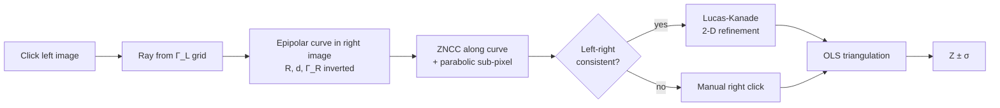
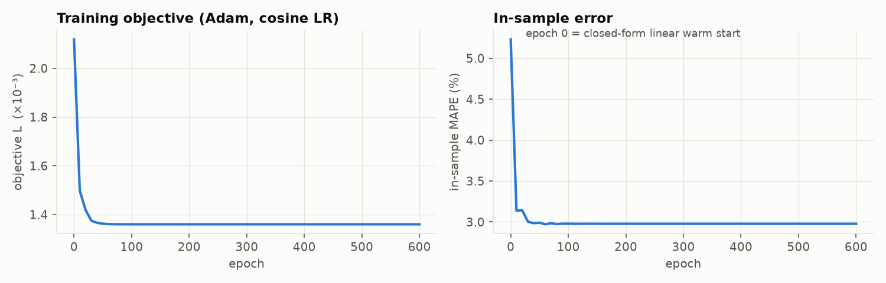

# Stereo Distance Calculator

[](https://github.com/GEV44/stereo-distance-calculator/actions/workflows/ci.yml)
[](pyproject.toml)
[](LICENSE)

**Metric distance from two cameras with a transparent, hand-derived model.** Each camera is
described by a 5×5 grid **Γ** of effective inverse focal lengths (the lens model); the rig by a
baseline and a relative rotation. Every gradient is derived analytically and the model is fitted
with Adam on a robust relative-disparity loss — **pure NumPy, no autodiff, no SciPy, no deep
learning**. The full derivation is in [`docs/MATHEMATICAL_FOUNDATION.pdf`](docs/MATHEMATICAL_FOUNDATION.pdf).


<sub>The measuring app on the built-in ray-traced demo scene (ground truth: box 2.0 m, panel 3.5 m).
Clicking the left image searches the curved epipolar line in the right image; accepted matches are
measured instantly as <i>Z ± σ</i>.</sub>

---

## Results at a glance

| | v1 (original) | **v2 (this version)** |
|---|---|---|
| Real data, leave-one-out MAPE (27 points) | 10.1 % (worst 77 %) | **5.1 %** (worst 21 %) |
| Synthetic distorted rig, held-out MAPE (N = 120) | 7.2 % | **0.5 %** |
| Calibration time | minutes (Python loops) | **0.3 s** (vectorised) |
| Right-image correspondence | manual click only | **automatic**: epipolar ZNCC + left-right check, 92.5 % precision |
| Measurement output | $Z$ | $Z \pm \sigma_Z$ (propagated uncertainty) |
| Tests | none | **40 tests** incl. finite-difference gradient checks |

All numbers are produced by [`scripts/reproduce_results.py`](scripts/reproduce_results.py) and listed
in full in [`results/RESULTS.md`](results/RESULTS.md).

---

## How it works



### The model

A pixel $(u,v)$ is normalised, $\tilde u=(u-C_X)/C_X,\ \tilde v=(v-C_Y)/C_Y$, and turned into a ray

$$
\mathbf r(u,v)=\big[\,\tilde u\,\gamma_x(u,v),\ \ \tilde v\,\gamma_y(u,v),\ \ 1\,\big]^\top ,
$$

where $\gamma_x,\gamma_y$ are bilinearly interpolated from the camera's $5\times5\times2$ grid Γ. For a
perfect pinhole $\gamma_x=C_X/f$ and $\gamma_y=C_Y/f$ everywhere; letting Γ vary over the image
absorbs lens distortion without any polynomial model.

The right camera is rotated into the left frame, $\mathbf w=R(\boldsymbol\omega)\,\mathbf r_R$,
$\hat{\mathbf r}_R=\mathbf w/w_z$, which turns the rig into a rectified one *in ray space*:

$$
Z\,\mathbf r_L - Z\,\hat{\mathbf r}_R = \mathbf d
\quad\Longrightarrow\quad
r_{L,x}-\hat r_{R,x}=\frac{d_x}{Z},\qquad r_{L,y}-\hat r_{R,y}=\frac{d_y}{Z}.
$$

**Triangulation** solves $A\mathbf x=\mathbf d$, $A=[\mathbf r_L,\ -\hat{\mathbf r}_R]$ by ordinary least
squares $\mathbf x=(A^\top A)^{-1}A^\top\mathbf d$, $Z=x_1$ (a batch-gradient-descent solver of the same
problem is included and verified to converge to it).

**Calibration** minimises, over Γ_L, Γ_R, $d_x$, $d_y$ and the three angles,

$$
\mathcal L=\frac1N\sum_i\Big[\rho_\delta(e_{x,i})+\lambda_y\,\rho_\delta(e_{y,i})\Big]
+\frac{\lambda_a}{2}\lVert\Gamma-\Gamma_0\rVert^2+\lambda_s\,E_{\text{membrane}}(\Gamma),
\qquad e_x=(r_{L,x}-\hat r_{R,x})\frac{Z}{d_x}-1 ,
$$

a **relative-disparity** error (5 % at 1 m costs the same as 5 % at 5 m, no $Z^2$ gradient blow-up)
under a **Huber** loss (δ = 5 %) that caps the influence of mis-clicks, plus an anchor prior and a
membrane smoothness energy on the grids. It is initialised in closed form (a linear least-squares
solve for baseline and rotation) and refined with **Adam** (cosine learning-rate decay).

---

## What changed from v1 — and why

Every change was driven by a measurement, not by taste.

| Finding in v1 | Evidence | Fix in v2 |
|---|---|---|
| The rig has **~1° yaw and ~1° roll**; v1 assumed parallel cameras. A multiplicative Γ cannot produce the constant disparity offset (yaw) or the x↔y coupling (roll). | Pixel disparity fits $\Delta u = 575/Z + 61$ px; vertical disparity grows linearly with $u$ (+44 px right edge, −32 px left edge). | Relative rotation $R(\boldsymbol\omega)$ with exact analytic derivatives. Removing it costs +3 pp LOOCV error (ablation below). |
| A single γ per node scaled the **vertical ray by $C_X/C_Y=4/3$**. | $\gamma=C_X/f$ cannot also equal $C_Y/f$. | Two channels per node, $\Gamma_0=[C_X/f,\ C_Y/f]$. Old files load with $\gamma_y=\gamma_x$, which reproduces v1 exactly. |
| The README and PDF described Adam, Huber, anchor prior, epipolar ZNCC and post-correction, but **the code used plain GD, squared loss and row-only NCC**. | Code review. | All of them are now implemented as documented, and each one's effect is measured. |
| The "Laplacian" smoothness was applied to interior nodes only, so it was **not the gradient of any energy**. | Finite-difference check. | Membrane energy with its exact graph-Laplacian gradient. |
| The NCC hint searched the **clicked image row**, but with roll the true match is up to ~40 px off it. | Rig geometry. | Search along the model's curved epipolar line, plus a left-right consistency check. |
| Training looped over points in Python (**minutes**). | Profiling. | Fully vectorised: 0.3 s. |
| The quadratic **post-correction hurts** when evaluated honestly. | LOOCV 5.1 % → 6.9 %. | Implemented, but off by default. |
| v1 loaded old 4×4 calibrations with SciPy, which was **not in `requirements.txt`**, so loading failed silently. | Code review. | Own bilinear resampling, no SciPy. |

---

## Results

### Real dataset — leave-one-out cross-validation

With only 27 labelled points, every number below is **leave-one-out**: 27 fits, each predicting the
one point it did not see. The error bars are 95 % bootstrap CIs.


| Model | MAE (m) | MAPE | 95 % CI | median | δ<1.05 | worst |
|---|---|---|---|---|---|---|
| v1 original (reproduced exactly) | 0.319 | 10.08 % | 5.7–16.3 % | 5.98 % | 37 % | 77.2 % |
| Pinhole + disparity offset (2 params) | 0.175 | 5.90 % | 4.3–7.7 % | 5.09 % | 48 % | 15.8 % |
| Pinhole + rotation (Γ frozen) | 0.143 | 5.40 % | 3.8–7.2 % | 4.01 % | 52 % | 18.0 % |
| Γ grid, no rotation | 0.226 | 8.22 % | 5.4–11.2 % | 5.77 % | 41 % | 27.8 % |
| **Γ grid + rotation (v2, default)** | **0.151** | **5.14 %** | 3.3–7.2 % | 4.03 % | 59 % | 20.8 % |
| v2 + quadratic post-correction | 0.166 | 6.89 % | 4.4–10.1 % | 5.52 % | 44 % | 36.7 % |

**Reading this honestly.** v2 halves v1's error. A paired bootstrap puts the improvement at
4.9 percentage points (95 % CI 0.7–10.4, p ≈ 0.008), so it is not chance. Among the v2-family models the differences are *within* the confidence intervals. Three
points are about 15 % off for **every** model, including the 2-parameter baseline, and two
neighbouring points disagree in opposite directions. That is label/click noise, a floor near 5 %
that no model can beat with 27 points. (We also checked whether the labels are straight-line range
rather than depth along the optical axis: depth fits better, 5.1 % vs 5.9 %.)

### Controlled benchmark — does the Γ grid help?

To answer that without label noise, a rig from a *different* model family is simulated:
Brown–Conrady radial distortion, unequal focal lengths, off-centre principal points and a
0.9°/−1.1° yaw/roll. Γ models are fitted on N noisy points and scored on 500 held-out points.


| held-out MAPE, σ = 0.5 px | N = 15 | 30 | 60 | 120 |
|---|---|---|---|---|
| Pinhole + offset | 3.95 | 4.09 | 3.85 | 3.90 |
| v1 original | 10.73 | 10.97 | 8.22 | 7.15 |
| Pinhole + rotation | 3.09 | 2.57 | 2.43 | 2.52 |
| **Γ grid + rotation (v2)** | **0.98** | **0.72** | **0.62** | **0.50** |

**Your Γ strategy is the right idea.** Once the rotation is modelled, the grid approximates a real
distorted lens **4–5× better than a pinhole model**, and it keeps improving with more calibration
points. On the real rig the limit is the data, not the model.

### Automatic correspondence

Test setup: a ray-traced scene (textured planes at 2 m, 3.5 m and 6 m plus a floor) seen through
the simulated rig, with 200 random clicks.

| accepted (ZNCC + left-right check) | precision (depth error < 3 %) | median depth error | time / click |
|---|---|---|---|
| 80 % | **92.5 %** | 0.6 % | 17 ms |

Rejected clicks (mostly occluded or texture-less points) fall back to a manual right click, which is
always authoritative.

### What the model learned




---

## Quick start

```bash
git clone https://github.com/GEV44/stereo-distance-calculator.git
cd stereo-distance-calculator
pip install -r requirements.txt          # numpy, pygame, matplotlib, opencv-python
```

### Try it without a camera

```bash
python -m stereo_gamma demo
```

This ray-traces a synthetic stereo pair (≈15 s, cached in `demo_output/`), calibrates on 40
simulated clicks and opens the app. Click the box (2.0 m), the panel (3.5 m) or the wall (6.0 m).

### Measure with your rig

```bash
python run_math.py left.jpg right.jpg                 # same as: python -m stereo_gamma measure left.jpg right.jpg
```

Images should be 2592×1944 (other sizes with the same aspect ratio are rescaled). If
`stereo_calibration.json` exists the app is ready to measure; otherwise add calibration points (below).

### Calibrate

1. In the app press **K**, type the true distance in metres and press **Enter**, then click the
   object in the left image and in the right image. Repeat.
2. From 15 points on, the model retrains automatically after each new point (≈0.3 s) and saves
   `stereo_calibration.json`.
3. Press **V** to see how many points fall in each Γ-grid cell. Aim for **≥ 30 points**, every cell
   covered, and distances spread over the working range. Label the **depth along the camera's
   viewing direction**, not the slant distance.

Or work offline:

```bash
python collect_points.py                              # label pairs in left/ and right/ → training_data.json
python -m stereo_gamma train --points cal_pts.json --cv   # fit + leave-one-out report
python -m stereo_gamma evaluate                      # per-point residuals, outlier flags
```

### Use it as a library

```python
from stereo_gamma import StereoModel, load_points, train

model, _ = train(load_points("cal_pts.json"))
Z = model.depth(uL=1546, vL=1028, uR=1250, vR=1050)          # → 2.49 m (label: 2.50 m)
Z, sigma, _ = model.depth_uncertainty(1546, 1028, 1250, 1050)
```

## Controls

| Key | Action |
|-----|--------|
| **Left click** (left image) | Pick a point; the match is searched along the epipolar curve (auto-measures if reliable) |
| **Left click** (right image) | Set the correspondence manually (authoritative) |
| **K** | Add a calibration point (type distance → Enter → click left → click right) |
| **U** | Undo the last calibration point / cancel K |
| **G** | Retrain now |
| **C C** | Clear all calibration (press twice) |
| **R** | Clear measurements |
| **A** | Toggle auto-match |
| **V** | Toggle Γ-cell coverage overlay |
| **T** | Swap left/right images |
| **S** / **E** | Screenshot / export measurements to CSV |
| **Wheel** / **right-drag** | Zoom / pan |
| **H** / **Esc** | Help / quit (or cancel) |

The right panel shows the epipolar curve, depth markers at 1 / 2 / 5 / 10 m and the ZNCC match
(green = reliable).

---

## Repository layout

```
├── stereo_gamma/              # the package
│   ├── config.py              #   sensor geometry, hyper-parameters
│   ├── geometry.py            #   bilinear Γ, rays, rotation + Jacobians, membrane energy
│   ├── model.py               #   StereoModel: triangulation (OLS + GD), epipolar curves, uncertainty, I/O
│   ├── training.py            #   loss, analytic gradients, Adam, warm start, post-correction
│   ├── matching.py            #   CLAHE, epipolar ZNCC, left-right check, Lucas–Kanade
│   ├── evaluation.py          #   metrics, LOOCV, baselines
│   ├── synthetic.py           #   simulated distorted rig + ray-traced demo scene
│   ├── legacy.py              #   exact re-implementation of v1 (for the ablation)
│   ├── app.py                 #   Pygame measuring / calibration UI
│   ├── collect.py             #   OpenCV batch labelling tool
│   └── cli.py                 #   python -m stereo_gamma {measure,train,evaluate,demo,collect}
├── run_math.py                # entry point (unchanged usage)
├── collect_points.py          # entry point (unchanged usage)
├── stereo_calibration.json    # calibration of the real rig (v2 format, with LOOCV metadata)
├── cal_pts.json               # the 27 labelled real points
├── data/                      # sample dataset, v1 calibration (backward-compatibility fixture)
├── docs/                      # MATHEMATICAL_FOUNDATION.pdf (+ .tex source), figures
├── results/                   # RESULTS.md, results.json (generated)
├── scripts/reproduce_results.py
└── tests/                     # 40 pytest tests
```

## Reproducing and testing

```bash
pip install -r requirements-dev.txt
pytest -q                                 # 40 tests, ~5 s
ruff check .
python scripts/reproduce_results.py       # every table and figure in this README, ~4 min
cd docs && pdflatex MATHEMATICAL_FOUNDATION.tex   # rebuild the PDF (run twice for the TOC)
```

The tests include finite-difference checks of every analytic gradient, exact projection ↔
triangulation round-trips, a proof that `legacy.py` reproduces the original v1 code to 1e-12, recovery
of a distorted rig from noisy points, sub-pixel ZNCC/Lucas–Kanade accuracy, an end-to-end
click → match → depth test on a ray-traced scene, and a headless run of the app.

## Technical parameters

| Symbol | Value | Meaning |
|--------|-------|---------|
| $W\times H$ | 2592 × 1944 | sensor size; $C_X, C_Y$ = 1296, 972 |
| Γ | 5 × 5 × 2 per camera | γx, γy nodes; left centre node frozen = scale gauge |
| $f_0$ | 2880 px | nominal focal length (sets $\Gamma_0$; $d_x$ is the baseline expressed at $f_0$) |
| δ | 0.05 | Huber threshold (5 % relative disparity) |
| λ_y, λ_a, λ_s | 0.5, 3·10⁻³, 0.3 | epipolar weight, anchor prior, membrane smoothness (chosen by LOOCV) |
| Adam | lr 2·10⁻³ (Γ, d), 10⁻³ (ω); 600 epochs; cosine decay to 5 % | converges in ≈100 epochs |
| Bounds | Γ ∈ [0.05, 5], $d_x$ ≥ 0.02 m | physical clamps |
| Matching | 31 × 31 ZNCC, ≥ 0.6 score, LR error ≤ 2 px; 21 × 21 LK | |
| Auto-train | ≥ 15 points | |

## Limitations and future work

- **Data is the bottleneck.** 27 hand-clicked points with ~5 % label noise cap the real-rig accuracy.
  A printed chessboard or ArUco board at several measured distances would give hundreds of sub-pixel
  points. The synthetic benchmark suggests about 1 % would then be reachable.
- $d_x$ is only physically meaningful if the true focal length equals $f_0$ (a gauge choice). Depth
  itself is unaffected.
- Matching is per click. Dense disparity (e.g. semi-global matching) is out of scope.
- Possible extensions: bundle adjustment (use correspondences without known distance), multi-scale
  grids, a learned confidence for auto-matching.

## References

1. R. Hartley, A. Zisserman — *Multiple View Geometry in Computer Vision*, 2004.
2. Z. Zhang — A flexible new technique for camera calibration, *IEEE TPAMI*, 2000.
3. D. C. Brown — Decentering distortion of lenses, *Photogrammetric Engineering*, 1966.
4. P. J. Huber — Robust estimation of a location parameter, *Ann. Math. Statist.*, 1964.
5. D. P. Kingma, J. Ba — Adam: a method for stochastic optimization, *ICLR*, 2015.
6. B. D. Lucas, T. Kanade — An iterative image registration technique, *IJCAI*, 1981.
7. K. Zuiderveld — Contrast limited adaptive histogram equalization, *Graphics Gems IV*, 1994.
8. H. Hirschmüller — Semi-global matching and mutual information, *IEEE TPAMI*, 2008.

## Author

**Gevorg** — [GitHub @GEV44](https://github.com/GEV44) · cite via [`CITATION.cff`](CITATION.cff)

## License

MIT — see [LICENSE](LICENSE).
